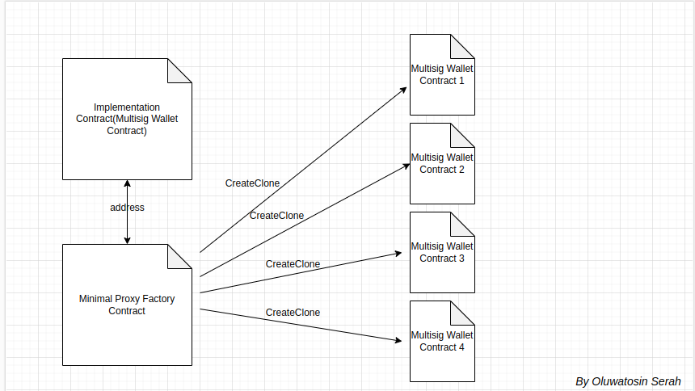
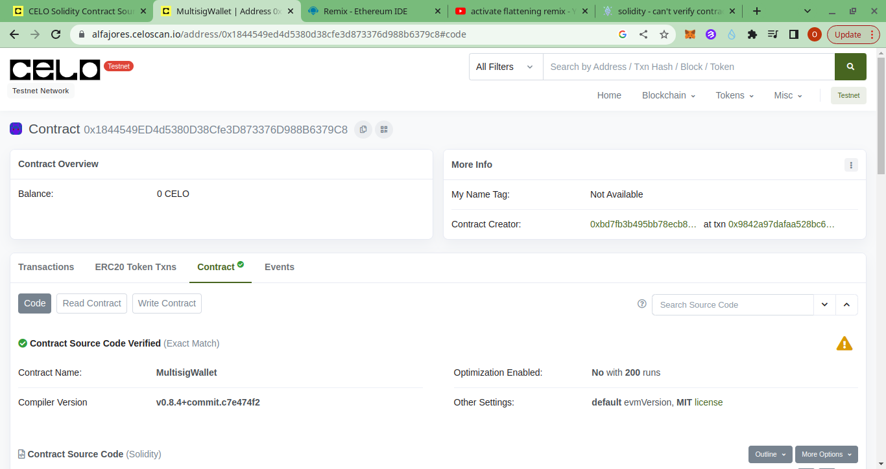
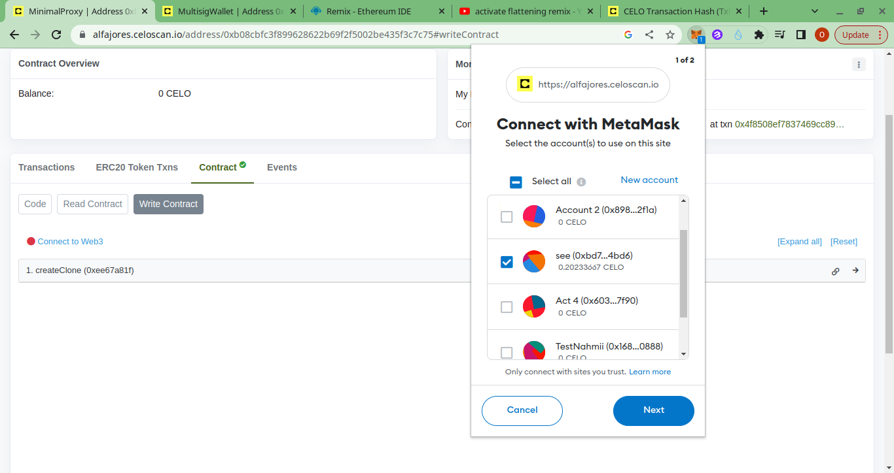
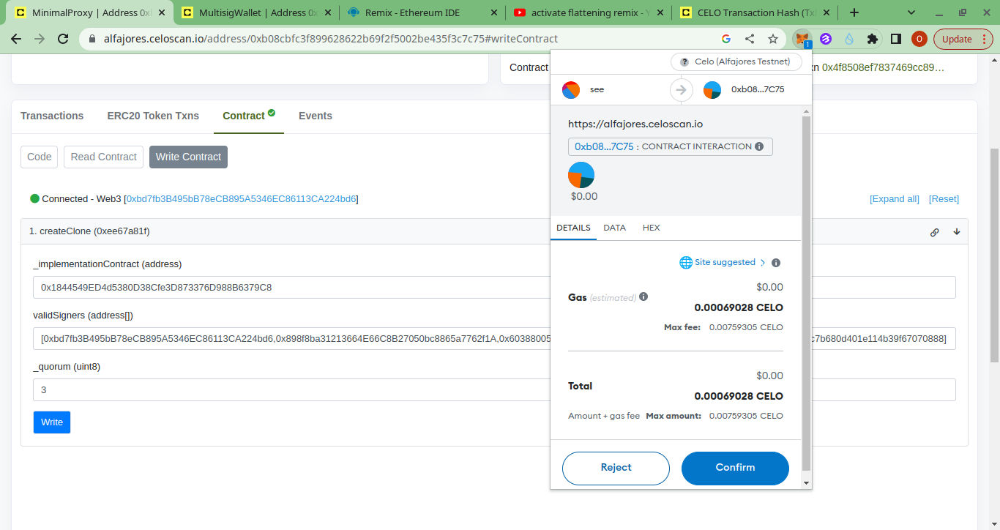
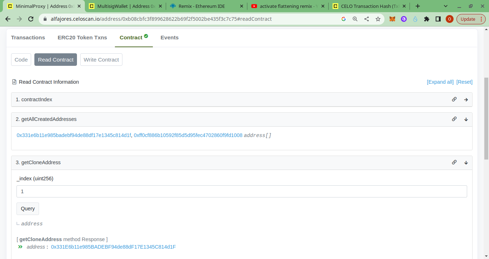
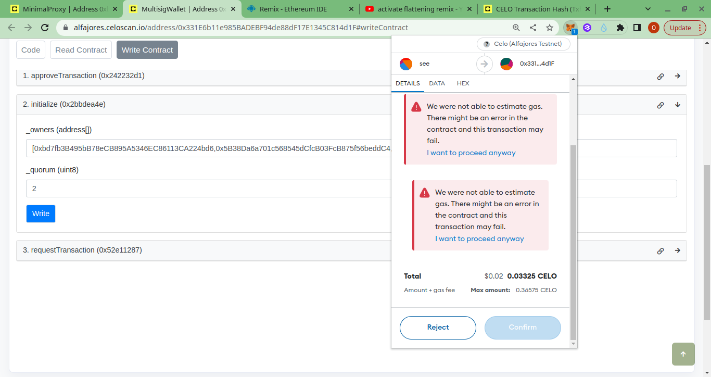
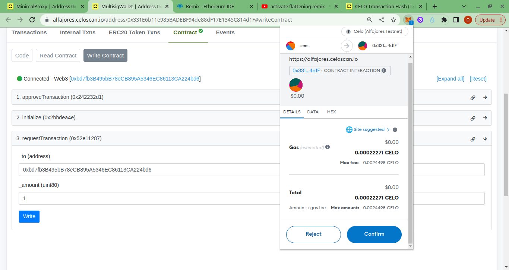
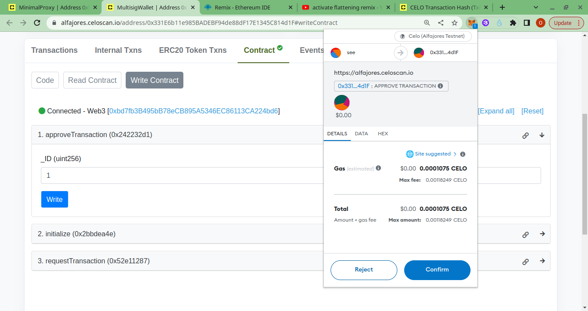

# Multi-Sig Wallet Minimal Proxy on Celo and Its Application in Smart Contracts

---

## Introduction

This article provides a comprehensive guide on building a Multi-signature Wallet Minimal Proxy on Celo Blockchain. In addition to providing a detailed explanation of the technical process involved in deploying the smart contract, I will also demonstrate how to interact with it. [Multisig contracts](https://www.bitpanda.com/academy/en/lessons/what-are-multi-signature-wallets-and-how-do-they-work/) are an essential tool for decentralized decision-making and governance, enabling multiple parties to authorize transactions on the blockchain.
<br/>
With the help of this article, you can follow the step-by-step instructions provided to create and utilize your own Multisig Wallet Minimal Proxy Contract on the Celo Blockchain. Whether you're a seasoned blockchain developer or a curious beginner, this article is sure to leave you feeling confident and empowered to leverage the power of Multisig contracts on the Celo network.

## Table of Contents

- [Multi-Sig Wallet Minimal Proxy on Celo and Its Application in Smart Contracts](#multi-sig-wallet-minimal-proxy-on-celo-and-its-application-in-smart-contracts)
  - [Introduction](#introduction)
  - [Table of Contents](#table-of-contents)
  - [Objective](#objective)
  - [Prerequisites](#prerequisites)
  - [Requirements](#requirements)
  - [What Is a Multi-Sig Wallet?](#what-is-a-multi-sig-wallet)
    - [Benefits of Using a Multi-Sig Wallet](#benefits-of-using-a-multi-sig-wallet)
  - [Factory Contract](#factory-contract)
    - [Types of Factory Contract Patterns](#types-of-factory-contract-patterns)
    - [Cloned Factory Contract Using Minimal Proxy](#cloned-factory-contract-using-minimal-proxy)
  - [Tutorial](#tutorial)
    - [Step 1 - Set Up Hardhat Environment](#step-1---set-up-hardhat-environment)
    - [Step 2 - Create Your Smart Contracts](#step-2---create-your-smart-contracts)
      - [Multisig Wallet Contract Explained](#multisig-wallet-contract-explained)
      - [Minimal Proxy Contract Explained](#minimal-proxy-contract-explained)
    - [Step 3 - Deploying Your Contracts](#step-3---deploying-your-contracts)
    - [Step 4 - Verifying Your Contracts](#step-4---verifying-your-contracts)
    - [Step 5 - Interacting With the Deployed Contracts](#step-5---interacting-with-the-deployed-contracts)
      - [Making a Clone of the Multisig Wallet Contract](#making-a-clone-of-the-multisig-wallet-contract)
  - [Conclusion](#conclusion)

## Objective

Upon completion of this article, you'll possess the knowledge and skills needed to proficiently create and interact with your own Multi-Sig Minimal Proxy on the Celo blockchain. You'll gain a deep understanding of the technical aspects required to deploy the smart contract and navigate its functions seamlessly. By the end of it all, you'll be equipped to confidently utilize Multisig contracts on the Celo network, regardless of your level of expertise.

## Prerequisites

- Understanding of Solidity: It is important to have a strong understanding of Solidity as it is the main programming language for creating smart contracts on the Celo blockchain.

- Command line proficiency: Basic familiarity with using command line tools such as Terminal or Command Prompt is necessary for running commands and scripts.

- Proficiency in Hardhat: It is essential to have a good grasp of using Hardhat, a development environment designed for writing, testing, and deploying smart contracts on the Celo blockchain.

## Requirements

- A text editor: For this tutorial, we will make use of [Visual Studio Code](https://code.visualstudio.com/), so ensure you have VS Code setup on your PC: VSCode is a popular integrated development environment (IDE) for building software.
- You will need to have [Node.js](https://nodejs.org/en) installed on your system, with version V10. or higher.
- Npm (node package manager) is used for installing and managing dependencies.

## What Is a Multi-Sig Wallet?

A multi-signature wallet, short for multi-sig is a type of cryptocurrency wallet that requires multiple signatures (or approvals) from different users or addresses to authorize a transaction. The purpose of a multi-sig wallet is to provide an extra layer of security and protection against unauthorized transactions, as multiple parties are required to sign off on any transactions.

### Benefits of Using a Multi-Sig Wallet

1. **Enhanced security**: With multiple signatures required to authorize a transaction, a multi-sig wallet provides increased security and protection against theft or unauthorized access.

2. **Shared control**: A multi-sig wallet allows multiple parties to have shared control over funds, which can be useful for organizations or groups that require collective decision-making.

3. **Reduced risk of human error**: Multisig wallets can reduce the risk of human error, as multiple parties are required to approve transactions, which can help prevent mistakes or fraudulent activity.

4. **Customizable authorization**: Multisig wallets can be customized to require a specific number of signatures, which can be useful for different use cases and scenarios.

## Factory Contract

A [factory contract](https://research.csiro.au/blockchainpatterns/general-patterns/contract-structural-patterns/factory-contract/) is a smart contract designed to produce and deploy other smart contracts. In other words, it acts as a template or a blueprint for the creation of new smart contracts. Factory contracts can be used to automate the process of smart contract creation, reducing the time and resources required to develop and deploy new contracts.

### Types of Factory Contract Patterns

The two factory contract patterns are:

1. **[Simple Factory Pattern](https://blog.logrocket.com/cloning-solidity-smart-contracts-factory-pattern/#the-factory-pattern)**: This pattern deploys multiple instances of other contracts without any optimization to save gas on each deployment. This pattern is useful when there are no specific optimization requirements for the smart contracts being deployed.

2. **[Cloned Factory Pattern](https://blog.logrocket.com/cloning-solidity-smart-contracts-factory-pattern/#the-cloned-factory-pattern-the-right-pattern-for-deploying-multiple-instances-of-our-solidity-smart-contract)**: This pattern deploys multiple instances of other contracts with an emphasis on optimization to save gas on each deployment. This pattern is useful when there is a need to optimize the gas costs associated with deploying smart contracts, which can result in significant cost savings.
   <br/>

Both patterns can be used to create and deploy multiple instances of smart contracts, but the Cloned Factory Pattern is specifically designed to optimize the gas costs associated with deployment. The choice of which pattern to use will depend on the specific requirements of the project, such as the need for gas optimization or the complexity of the smart contracts being deployed.

### Cloned Factory Contract Using Minimal Proxy

The Clone Factory Contract is a reference implementation of the [EIP-1167](https://eips.ethereum.org/EIPS/eip-1167) standard, which is an Ethereum Improvement Proposal for creating **Minimal proxy contracts**. The Clone Factory Contract is designed to optimize the gas costs associated with deploying new instances of smart contracts by using a minimal proxy contract that points to a master contract. When a new instance is needed, the minimal proxy contract is cloned and the address of the new contract is updated to point to the new instance. This approach reduces the gas costs associated with deploying new instances because only the minimal proxy contract needs to be deployed once, and subsequent instances can be created by simply cloning the minimal proxy contract and updating the contract address.
<br/>

In this tutorial, we will be making use of the Cloned factory pattern.

## Tutorial

### Step 1 - Set Up Hardhat Environment

To begin setting up the Hardhat environment for your smart contract implementation, you will first need to create a new folder on your system. You can do this by using the ‘mkdir’ command in your terminal followed by the desired name of your folder. For example:

```bash
mkdir multisig-wallet
```

Next, navigate to your project folder using the ‘cd’ command, like so:

```bash
cd multisig-wallet
```

Once you have changed the directory to the folder, you can initialize a new npm project inside it by running the following command:

```bash
npm init -y
```

This will create a “package.json” file in your project folder with default settings.
Run the following command to initialize the Hardhat environment and create some default configuration files and folders required for building and testing smart contracts.

```bash
npm install hardhat --save-dev
npx hardhat
```

We will be using a typescript project for this tutorial, so click on “Create a typescript project” and enter this and other prompt options.
<br/>

Finally, open your project folder in VScode by running this command in your terminal:

```bash
code .
```

This will open up your project folder in Visual Studio Code, where you can start setting up your Hardhat environment and writing your smart contract code.
<br/>

### Step 2 - Create Your Smart Contracts

In the root directory of your project, you'll find a folder called "contracts". To create a new TypeScript file, simply navigate to this folder and add your new files.
<br/>

For this tutorial, we'll be creating a Multisignature Wallet Minimal Proxy Contract. To create these contracts, we'll need to generate two files:

- Multisig Wallet contract file
- Minimal Proxy contract file

#### Multisig Wallet Contract Explained

```solidity
// SPDX-License-Identifier: MIT
pragma solidity ^0.8.4;

contract MultisigWallet {
  event Deposit(address indexed sender, uint256 amount, uint256 contractBal);
  event TransactionRequested(
    address indexed owner,
    uint256 indexed txnID,
    address indexed to,
    uint256 amount
  );
  event TransactionApproved(address indexed owner, uint256 indexed txnID);

  uint8 public constant MAX_OWNERS = 20;
  uint8 numofApprovalsRequired;
  address public factory;
  bool initialState;
  address[] validOwners;

  struct Transaction {

    address recipient;
    uint8 numOfConformations;
    bool approved;
    uint80 amountRequested;
  }

  uint256[] successfulTxnIDs;

  uint256 txnIDs = 1;

  //mapping to keep track of all transactions
  mapping(uint256 => Transaction) _transactions;
  //mapping to check if an owner as approved a transaction
  mapping(uint256 => mapping(address => bool)) public hasApprovedtxn;
  //mapping to check if an address is part of the owners
  mapping(address => bool) isOwner;


  /**
    * @notice Initializes the validOwners and numofApprovalsRequired variables with the input parameters
    * @param _owners An array containing the addresses of the owners
    * @param _quorum The number of approval required to validate requests 
  */
  function initialize(address[] memory _owners, uint8 _quorum) external {
    require(initialState == false, "Contract Already Initialized");
    require(_quorum <= _owners.length, "Out of Bound!");

    require(_owners.length <= MAX_OWNERS, "Invalid owners");
    for (uint i; i < _owners.length; i++) {
      address owner = _owners[i];
      notAddressZero(owner);
      isOwner[owner] = true;
    }

    factory = msg.sender;
    validOwners = _owners;
    numofApprovalsRequired = _quorum;
    initialState = true;
  }

  /**
    * @dev Caller is checked to be a valid owner
    * @notice Allows an owner to request and create a transaction
    * @param _to The beneficiary of the request
    * @param _amount The amount required to fulfill the transaction
  */
  function requestTransaction(
  address _to,
  uint80 _amount
) external returns (uint256) {
  isAnOwner(msg.sender);
  notAddressZero(_to);
  require(_amount > 0, "Invalid amount requested"); // New input validation check
  Transaction storage txn = _transactions[txnIDs];
  txn.recipient = _to;
  txn.amountRequested = _amount;
  uint256 currentTxnID = txnIDs;

  txnIDs = txnIDs + 1;

  emit TransactionRequested(msg.sender, currentTxnID, _to, _amount);
  return currentTxnID;
}

  /**
    @dev If quorum is reached, the transaction is approved and the funds are transferred to the beneficiary
    @notice Allow owners to approve a pending transaction
    @param _ID The index of the transaction in the _transactions mapping
  */
  function approveTransaction(uint256 _ID) external {
    isAnOwner(msg.sender);

    require(hasApprovedtxn[_ID][msg.sender] == false, "Already Approved");
    require(_ID > 0 && _ID < txnIDs, "InvalidID");

    Transaction storage txn = _transactions[_ID];
    require(txn.approved == false, "Txn has been completed");
    txn.numOfConformations = txn.numOfConformations + 1;
    hasApprovedtxn[_ID][msg.sender] = true;

    address beneficiary = txn.recipient;
    uint256 amount = txn.amountRequested;

    if (txn.numOfConformations >= numofApprovalsRequired) {
      require(address(this).balance >= amount, "Not enough balance to transfer funds");
      txn.approved = true;
      (bool success, ) = payable(beneficiary).call{ value: amount }("");
      require(success, "txn failed");
      successfulTxnIDs.push(_ID);
    }

    emit TransactionApproved(msg.sender, _ID);
  }

  function getTxnsCount() external view returns (uint256) {
    return txnIDs;
  }

  function isAnOwner(address user) private view {
    require(isOwner[user], "Not a valid owner");
  }

  function notAddressZero(address user) private pure {
    require(user != address(0), "Invalid Address");
  }

  function getAllowners() external view returns (address[] memory) {
    return validOwners;
  }

  function getAlltxnDetails(
    uint256 _ID
  ) external view returns (Transaction memory) {
    Transaction storage txn = _transactions[_ID];
    return txn;
  }

  function allSuccessfulTxnIDs() external view returns (uint256[] memory) {
    return successfulTxnIDs;
  }

  receive() external payable {
    emit Deposit(msg.sender, msg.value, address(this).balance);
  }
}
```

The multi-signature wallet requires multiple owners to approve transactions before they can be executed. The contract includes the following components:

- There are state variables that are used to keep track of the state of the contract. These variables include the maximum number of owners allowed, the number of approvals required for a transaction to be executed, the address of the factory that created the contract, an array of valid owners, an array of all transactions, an array of successful transaction IDs, and the ID of the next transaction to be created.
- The contract has an `initialize()` function that serves as the contract's constructor, it takes an array of valid owners and a quorum (the number of approvals required for a transaction to be executed).
- The contract has several functions that can be called by anyone who is a valid owner of the contract. These functions include `requestTransaction()` and `approveTransaction()`.
- The `requestTransaction()` function allows an owner to create a new transaction by specifying the recipient and amount. The function returns the ID of the newly created transaction.
- The `approveTransaction()` function allows an owner to approve a transaction by specifying the ID of the transaction. The function checks that the transaction has not already been approved and that the ID is valid.
  If the number of approvals for the transaction meets the required quorum, the function executes the transaction and adds the transaction ID to the list of successful transaction IDs.

- The `getTxnsCount()` function returns the number of transactions that have been created.
- The `getAllowners()` function returns an array of all valid owners of the contract.
- The `getAlltxnDetails()` function returns the details of a specific transaction by ID.
- The `allSuccessfulTxnIDs()` function returns an array of all successful transaction IDs.
- The contract includes a `receive()` function that allows the contract to receive Ether, which is emitted as a Deposit event.
- The contract also includes some mappings. These mappings include \_transactions (which maps transaction IDs to transaction details), hasApprovedtxn (which maps transaction IDs to the approval status of each owner), and isOwner (which maps addresses to a boolean indicating whether or not the address is a valid owner).

#### Minimal Proxy Contract Explained

```solidity
// SPDX-License-Identifier: MIT
pragma solidity ^0.8.4;

interface IMultisigWallet {
  function initialize(address[] memory _owners, uint8 _quorum) external;
}

contract MinimalProxy {
  event ContractCreated(address indexed newMultisig, uint256 position);

  mapping(uint256 => address) cloneAddresses;
  uint256 contractIndex = 1;

  address[] allClonedMultiSigContractAddresses;

  function createClone(
    address _implementationContract,
    address[] memory validSigners,
    uint8 _quorum
  ) external returns (address) {
    // convert the address to 20 bytes
    bytes20 implementationContractInBytes = bytes20(_implementationContract);

    //address to assign cloned proxy
    address proxy;

    // as stated earlier, the minimal proxy has this bytecode
    // <3d602d80600a3d3981f3363d3d373d3d3d363d73><address of implementation contract><5af43d82803e903d91602b57fd5bf3>

    // <3d602d80600a3d3981f3> == creation code which copy runtime code into memory and deploy it

    // <363d3d373d3d3d363d73> <address of implementation contract> <5af43d82803e903d91602b57fd5bf3> == runtime code that makes a delegatecall to the implentation contract

    assembly {
      /*
            reads the 32 bytes of memory starting at pointer stored in 0x40
            In solidity, the 0x40 slot in memory is special: it contains the "free memory pointer"
            which points to the end of the currently allocated memory.
            */
      let clone := mload(0x40)
      // store 32 bytes to memory starting at "clone"
      mstore(
        clone,
        0x3d602d80600a3d3981f3363d3d373d3d3d363d73000000000000000000000000
      )

      /*
              |              20 bytes                |
            0x3d602d80600a3d3981f3363d3d373d3d3d363d73000000000000000000000000
                                                      ^
                                                      pointer
            */
      // store 32 bytes to memory starting at "clone" + 20 bytes
      // 0x14 = 20
      mstore(add(clone, 0x14), implementationContractInBytes)

      /*
              |               20 bytes               |                 20 bytes              |
            0x3d602d80600a3d3981f3363d3d373d3d3d363d73bebebebebebebebebebebebebebebebebebebebe
                                                                                              ^
                                                                                              pointer
            */
      // store 32 bytes to memory starting at "clone" + 40 bytes
      // 0x28 = 40
      mstore(
        add(clone, 0x28),
        0x5af43d82803e903d91602b57fd5bf30000000000000000000000000000000000
      )

      /*
            |                 20 bytes                  |          20 bytes          |           15 bytes          |
            0x3d602d80600a3d3981f3363d3d373d3d3d363d73b<implementationContractInBytes>5af43d82803e903d91602b57fd5bf3 == 45 bytes in total
            */

      // create a new contract
      // send 0 Ether
      // code starts at pointer stored in "clone"
      // code size == 0x37 (55 bytes)
      proxy := create(0, clone, 0x37)
    }
    IMultisigWallet(proxy).initialize(validSigners, _quorum);

    cloneAddresses[contractIndex] = proxy;
    allClonedMultiSigContractAddresses.push(proxy);

    contractIndex = contractIndex + 1;

    emit ContractCreated(proxy, allClonedMultiSigContractAddresses.length);
    return proxy;
  }

  // Check if an address is a clone of a particular contract address
  function isClone(
    address _implementationContract,
    address query
  ) external view returns (bool result) {
    bytes20 implementationContractInBytes = bytes20(_implementationContract);
    assembly {
      let clone := mload(0x40)
      mstore(
        clone,
        0x363d3d373d3d3d363d7300000000000000000000000000000000000000000000
      )
      mstore(add(clone, 0xa), implementationContractInBytes)
      mstore(
        add(clone, 0x1e),
        0x5af43d82803e903d91602b57fd5bf30000000000000000000000000000000000
      )

      let other := add(clone, 0x40)
      extcodecopy(query, other, 0, 0x2d)
      result := and(
        eq(mload(clone), mload(other)),
        eq(mload(add(clone, 0xd)), mload(add(other, 0xd)))
      )
    }
  }

  function getAllCreatedAddresses() external view returns (address[] memory) {
    return allClonedMultiSigContractAddresses;
  }

  function getCloneAddress(uint256 _index) external view returns (address) {
    return cloneAddresses[_index];
  }

  function getCurrentIndex() external view returns (uint256) {
    return allClonedMultiSigContractAddresses.length;
  }
}
```

- The contract contains a `createClone()` function that deploys new instances of the multi-sig wallet contract by creating a minimal proxy contract. The deployed minimal proxy contract is a lightweight contract that points to the actual implementation contract.

**Pictorial Representation of the contract flow**


- The implementation contract's(Multisig Wallet) address is passed as a parameter to the createClone() function, along with an array of valid signers and a quorum number. The function then creates the minimal proxy using the implementation contract's address and assigns it to a variable named proxy.

- The `initialize()` function of the implementation contract is then called through the IMultisigWallet(proxy).initialize(validSigners, \_quorum) line, passing the valid signers and quorum as arguments.

- The created proxy contract's address is then stored in the cloneAddresses mapping, and the index of the contract is stored in `allClonedMultiSigContractAddresses`.

- There are also view functions defined in the contract to retrieve information about the created contracts. `getCloneAddress()` takes an index and returns the corresponding clone address, `getCurrentIndex()` returns the number of created contracts, and `isClone()` checks if a given address is a clone of the implementation contract.

- The contract uses assembly code to create the minimal proxy contract. The bytecode for the minimal proxy contract is created by concatenating the initialization code and runtime code, with the implementation contract address inserted in the appropriate location in the bytecode.

### Step 3 - Deploying Your Contracts

Before deploying your contract to the Celo testnet, ensure that you have added the Celo testnet RPC to your Metamask wallet, if not follow this [guide](https://docs.celo.org/blog/tutorials/3-simple-steps-to-connect-your-metamask-wallet-to-celo) to add it & also get faucet from this [site](https://faucet.celo.org/alfajores).
<br/>

Next, add the Celo network configuration to the hardhat.config.ts file located in the root directory of your project. To enable the use of your private key for your Celo account during contract deployment, you will need to install an env file. You can store your private key in the ".env" file and use the dotenv package to load it into your Hardhat configuration. Here is an example of how to configure it:

- Install the dotenv package:

```bash
npm install dotenv
```

- Create a .env file in the root directory of your project, paste your private key, and ETHERSCAN_API_KEY into it:

```
PRIVATE_KEY=<your-private-key>
ETHERSCAN_API_KEY = <ETHERSCAN_API_KEY>
```

Here’s an example of how to add the Celo network configuration to your hardhat.config.ts file:

```javascript
import { HardhatUserConfig } from "hardhat/config";
import "@nomicfoundation/hardhat-toolbox";
require("dotenv").config();


type HttpNetworkAccountsUserConfig = any;
const config: HardhatUserConfig = {
  solidity: "0.8.4",
  networks: {
    alfajores: {
      url: "https://alfajores-forno.celo-testnet.org",
      accounts: [process.env.PRIVATE_KEY] as HttpNetworkAccountsUserConfig | undefined,
      chainId: 44787,
    }
  },
  etherscan: {
    apiKey: process.env.ETHERSCAN_API_KEY
  }
};

export default config;

```

Next thing is to write our deploy scripts as follows:

```javascript
import { ethers } from "hardhat";

async function main() {
  ////////////DEPLOYING THE IMPLEMENTATION CONTRACT/////////////
  const MultisigWallet = await ethers.getContractFactory("MultisigWallet");
  const multisigWallet = await MultisigWallet.deploy();
  await multisigWallet.deployed();
  console.log(
    `Multisig Wallet contract is deployed to ${multisigWallet.address}`
  );

  ///////////////DEPLOYING MULTISIG WALLET MINIMAL PROXY FACTORY///////////////
  const MinimalProxyFactory = await ethers.getContractFactory("MinimalProxy");
  const minimalProxy = await MinimalProxyFactory.deploy();

  await minimalProxy.deployed();

  console.log(`Minimal Proxy Factory is deployed to ${minimalProxy.address}`);
}

// We recommend this pattern to be able to use async/await everywhere
// and properly handle errors.
main().catch((error) => {
  console.error(error);
  process.exitCode = 1;
});
```

First, let's compile our smart contract using this command line in our VSCode terminal:

```bash
npx hardhat compile
```

Then, let’s deploy our contract using this command line in our VSCode terminal:

```bash
npx hardhat run scripts/deploy.ts --network alfajores
```

### Step 4 - Verifying Your Contracts

To verify your contracts on the Celo Explorer, you can follow these steps:
<br/>

After your contract has been deployed, go to the [Celo Explorer](https://alfajores.celoscan.io/) and paste the contract’s address into the search field.
<br/>

After locating the address of the contract, select the “Contract” button and proceed to click on “Verify and Publish” in order to initiate the verification process.


Fill in the required information, such as the compiler version used to deploy your contract, the compiler type, and so on.


After clicking "Continue," you will be directed to another page. To authenticate your smart contract, you need to copy and paste its code into the "Enter the Solidity Contract Code below" field. If your contract's constructor function required arguments during deployment, you must also obtain and paste the ABI-encoded argument into the "Constructor Arguments ABI-encoded" field. If no arguments were provided during deployment, you can skip this step. As the contracts used in this tutorial do not contain a constructor function, we can skip that step.
<br/>

Submit the verification request by clicking the “Verify and Publish” button, and wait for it to be processed. This usually takes a few seconds.
<br/>

After successfully verifying your smart contract, you should be able to see it on the Celo Explorer with a green checkmark indicating that it has been verified.



You can do the same for the Minimal Proxy Factory as well.

- [Multisig Wallet Contract on Celo Testnet Explorer](https://alfajores.celoscan.io/address/0x1844549ed4d5380d38cfe3d873376d988b6379c8#code)
- [Minimal Proxy Factory Contract on Celo Testnet Explorer](https://alfajores.celoscan.io/address/0xb08cbfc3f899628622b69f2f5002be435f3c7c75#code)

### Step 5 - Interacting With the Deployed Contracts

After the successful verification and deployment of your smart contract, the subsequent phase involves interacting with it, which often entails utilizing a Web3 interface to invoke the functions specified in the contract and work with its data. In this tutorial, we will leverage Celo Explorer to interact with our smart contract.

#### Making a Clone of the Multisig Wallet Contract

Navigate to the Minimal Proxy Factory Contract on Celo Testnet [Explorer](https://alfajores.celoscan.io/address/0xb08cbfc3f899628622b69f2f5002be435f3c7c75#code) and click on the "Write Contract" button, then click on "Connect to web3" which will prompt you to either connect to MetaMask or WalletConnect, chose the wallet you are using here.


<br/>

To create a clone of the multi-sig contract, we need to pass 3 arguments, which are;

- The implementation contract address(Multisig wallet contract address)
- Array of valid owners for the new clone we want to create
- \_quorum(the number of approvals required for a transaction to be executed in the multi-sig).

Pass in the necessary arguments, and click on the "write" button to confirm the transaction on Metamask.



To read your minimal proxy contract and obtain the addresses of the newly created clones, click on the "Read Contract" button and read any function of your choice like so:



Click on the getCloneAddress() and pass an index of 1 to get the first created multi-sig wallet clone address which you can find [here](https://alfajores.celoscan.io/address/0x331E6b11e985BADEBF94de88dF17E1345C814d1F#code).
<br/>

Now, let's interact with the created multi-sig wallet clone contract.

- Click on the “Write Contract” tab in Celo Explorer.
- Connect to your Celo wallet by clicking on the “Connect Wallet” button and choosing your wallet provider.
- Select the function you want to write to and fill in any required parameters.
- Click the “Write” button to send the transaction to the blockchain.
- Review the transaction details and confirm the gas fee.

If you try to initialize the created clone, you should see something like this;



The reason for this is that the contract was initialized through the minimal proxy factory and its implementation was designed to prevent the state of the contract from being initialized twice, which could potentially lead to an attack on the contract.

**Requesting a transaction**
<br/>

Only an address that belongs to the valid owners is able to successfully request a transaction. If any address outside of the valid owners attempts to interact with these functions, the transaction would fail and revert.



**Approving a transaction**
<br/>

To validate and approve a transaction, only the designated owners who were added during the contract creation are authorized to do so. If an address that is not a valid owner attempts to trigger the approve function, the transaction approval process will fail. Additionally, before a transaction can be executed, the quorum set must be reached, meaning that the minimum required number of owners must approve the transaction.



You can then proceed to read the state of the contract after writing it.
<br/>

To create your own Minimal Proxy Multisig contract, you can replicate the following steps. By doing so, you will be able to deploy the contract and interact with it through celo explorer in a successful manner. Additionally, it is important to note that proper understanding and execution of these steps are crucial for ensuring the security and functionality of your contract.

## Conclusion

In conclusion, the minimal proxy multi-sig contract provides an efficient and secure way for multiple parties to manage their assets and make decisions on the Celo platform. By utilizing minimal proxy contracts, the deployment and maintenance costs are reduced, while the flexibility and control of the multi-sig functionality remain intact. It is important to carefully consider the ownership structure and security measures when deploying this type of contract to ensure the safety of the assets and the integrity of the decision-making process. I appreciate you staying till the end, and I trust that you have gained valuable insights from this tutorial.
<br/>

The link to my project repository can be found [here](https://github.com/Sayrarh/Multi-Sig-Minimal-Proxy-on-Celo).
